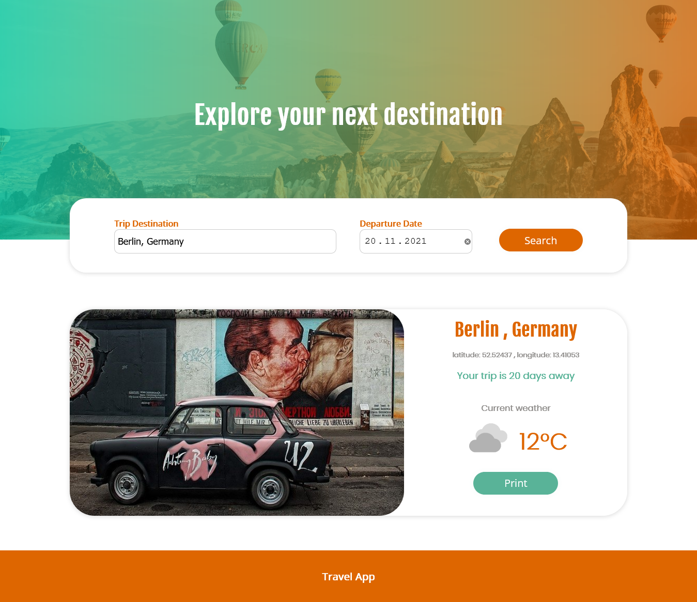

 # Travel App  
 ## Application where you can plan your next journey.
 ### Project Description

 This is capstone project of Udacity Nanodegree Program. It requires to build an app that obtains the information about estimated trip, such as: destination's location(longitude and latitude), current weather and quantity of days left untill the trip. Also it shows the image of the chosen destination. I used 3 different APIs(geonames, weatherbit and pixabay) to retrieve this information.

  ### Technologies used:

 HTML, JavaScript, Sass, Webpack, Express, API integration

 ### Instructions

**'_nmp start_'** to view the project on **_localhost:8081_**

